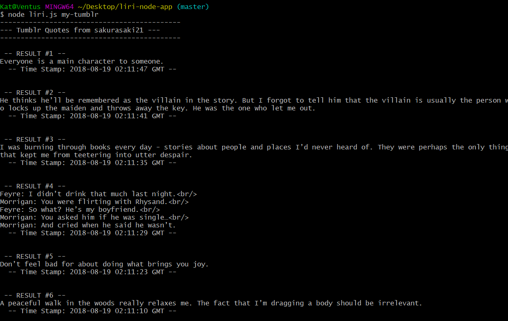
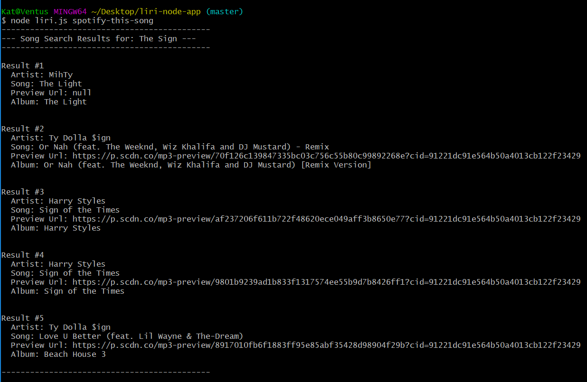
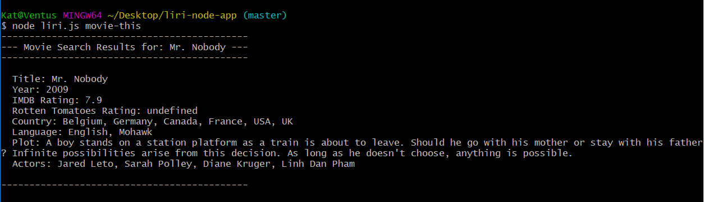

# liri-node-app
A _Language Interpretation and Recognition Interface_

<br/>

### __How to Setup__
1. Before you start anything remember to install the node_module packages by running: `npm i` or `npm install`

2. Next make sure your API Keys are set up. If you do not know how please go to the './keys.js' file and there are comments instructions provided on how to accomplish this

<br/>

### __How to Use__

In the command terminal use the command:
`node liri.js  <your command>`


__Command List:__

    * `my-tumblr`

    * `spotify-this-song`   (allows 2nd parameter of song name or defalts to "The Sign")

    * `movie-this`          (allows 2nd parameter of song name or defalts to "Mr. Nobody")

    * `do-what-it-says`


<br/><br/><br/>
# Finished Product:
my-tumblr:<br/>
<br/><br/>
spotify-this-song:<br/>
<br/><br/>
movie-this:<br/>
<br/><br/>
do-what-it-says:<br/>
<br/><br/>

<br/><br/><br/>
### Instructions

1. `node liri.js my-tumblr`

   * This will show your last 20 tumblr quote posts and when they were created at in your terminal/bash window.

2. `node liri.js spotify-this-song '<song name here>'`

   * This will show the following information about the song in your terminal/bash window
     ```
      * Artist(s)
      * The song's name
      * A preview link of the song from Spotify
      * The album that the song is from
     ```

   * If no song is provided then your program will default to "The Sign" by Ace of Base.

3. `node liri.js movie-this '<movie name here>'`

   * This will output the following information to your terminal/bash window:

     ```
       * Title of the movie.
       * Year the movie came out.
       * IMDB Rating of the movie.
       * Rotten Tomatoes Rating of the movie.
       * Country where the movie was produced.
       * Language of the movie.
       * Plot of the movie.
       * Actors in the movie.
     ```

   * If the user doesn't type a movie in, the program will output data for the movie 'Mr. Nobody.'

4. `node liri.js do-what-it-says`
   
   * LIRI will take the text inside of random.txt and then use it to call one of LIRI's commands.
     
   * It should run `spotify-this-song` for "I Want it That Way," as follows the text in `random.txt`.
     